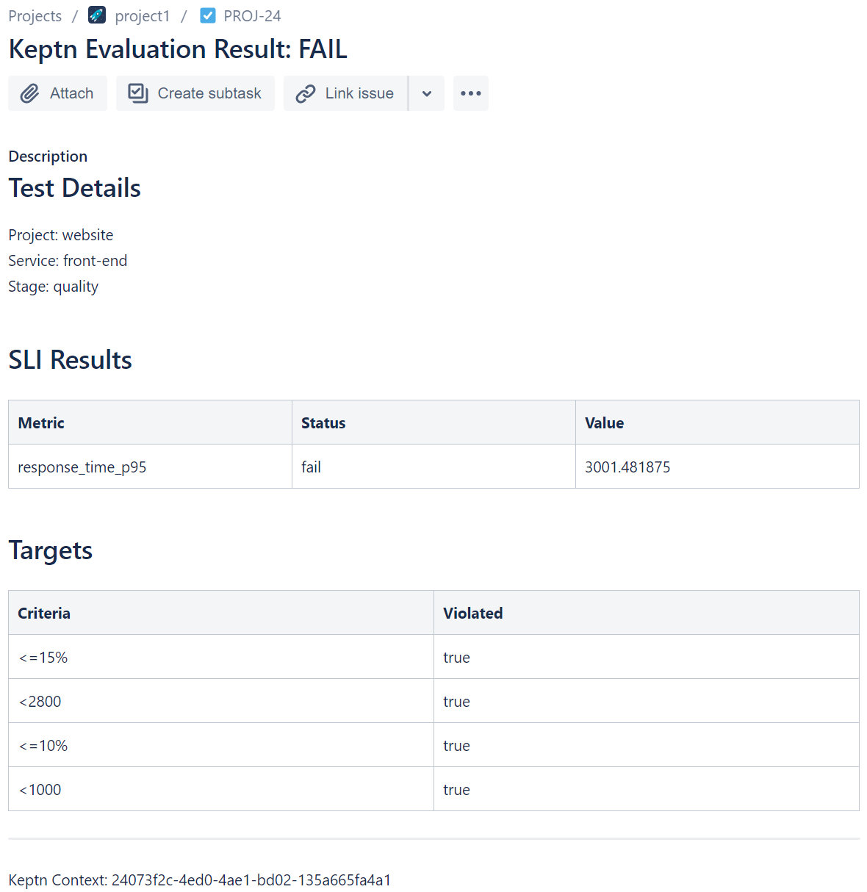
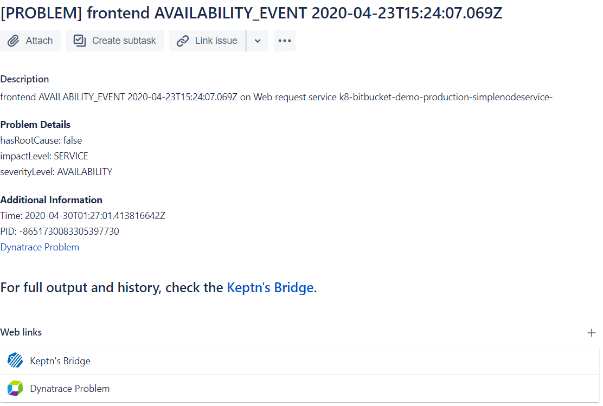

# JIRA Service

This service creates JIRA issues when Keptn performs a quality gate evaluation or a problem is raised.

The service will also comment on & close the issue (set the status to `Done`) whenever a problem `resolved` or `closed` status is received.

The service is subscribed to the following keptn events:

* `sh.keptn.events.evaluation-done`
* `sh.keptn.event.problem.open`
* `sh.keptn.events.problem`





# Gather JIRA Information
You'll need the following information to use this plugin.

1. JIRA Base URL (without trailing slash) eg. `https://abc123.atlassian.net`
1. JIRA Username eg. `joe.smith@example.com`
1. JIRA API Token ([generate one here](https://id.atlassian.com/manage/api-tokens))
1. JIRA Project Key. Take this from the URL. Eg. `PROJ` is the project code for `https://abc123.atlassian.net/projects/PROJ/issues`
1. JIRA Issue Type eg. Task, Bug, Epic etc. Defaults to `Task`.
1. Keptn base URL (eg. `http://localhost:8080` or however you've exposed Keptn)

# Save JIRA Details as k8s Secret
Paste your values into the command below (replacing `***`) and save the JIRA details into a secret called `jira-details` in the `keptn` namespace.

```
kubectl -n keptn create secret generic jira-details --from-literal="jira-base-url=***" --from-literal="jira-username=***" --from-literal="jira-api-token=***" --from-literal="jira-project-key=***" --from-literal="jira-issue-type=Task" --from-literal="jira-create-ticket-for-problems=true" --from-literal="jira-create-ticket-for-evaluations=true"
```

Expected output:

```
secret/jira-details created
```

# Install JIRA Service
Install the service & distributor.

Pull the `jira-service.yaml` and modify line `66` to reflect your keptn URL.

```
- name: KEPTN_DOMAIN
  value: 'http://keptn-domain-here'
```

Optional: Set your `KEPTN_BRIDGE_URL` (if empty, defaults to `KEPTN_DOMAIN`). This is used to link back to the bridge from JIRA tickets.

```
- name: KEPTN_BRIDGE_URL
  value: 'http://keptn.mysite.com/bridge'
```

Apply the jira-service.yaml and the distributor:
```
kubectl apply -f jira-service.yaml -f https://raw.githubusercontent.com/keptn-sandbox/jira-service/master/jira-distributor.yaml
```

Expected output:

```
deployment.apps/jira-service-distributor created
deployment.apps/jira-service created
service/jira-service created
```

# Usage / Testing
Ask Keptn to start an evaluation:
```
keptn send event start-evaluation --project=* --stage=* --service=* --timeframe=2m
```

# Debugging
A debug log is available in the `jira-service` pod at `/var/www/html/logs/jiraService.log`

```
kubectl exec -itn keptn jira-service-*-* cat /var/www/html/logs/jiraService.log
```

# Deleting This Service

Delete the `jira-details` secret, the distributor and service files:

```
kubectl delete secret -n keptn jira-details
kubectl delete -f jira-service.yaml -f https://raw.githubusercontent.com/keptn-sandbox/jira-service/master/jira-distributor.yaml
```

# Compatibility Matrix

| Keptn Version    | JIRA Version / API Version |
|:----------------:|:----------------------:|
|     0.7.3        |            Cloud (Classic and NextGen) / v2          |
|     0.7.2        |            Cloud (Classic and NextGen) / v2          |
|     0.7.1        |            Cloud (Classic and NextGen) / v2          |
|     0.7.0        |            Cloud (Classic and NextGen) / v2          |
|     0.6.1        |            Cloud (Classic and NextGen) / v2          |

# Contributions, Enhancements, Issues or Questions
Please raise a GitHub issue or join the [Keptn Slack channel](https://join.slack.com/t/keptn/shared_invite/enQtNTUxMTQ1MzgzMzUxLWMzNmM1NDc4MmE0MmQ0MDgwYzMzMDc4NjM5ODk0ZmFjNTE2YzlkMGE4NGU5MWUxODY1NTBjNjNmNmI1NWQ1NGY).